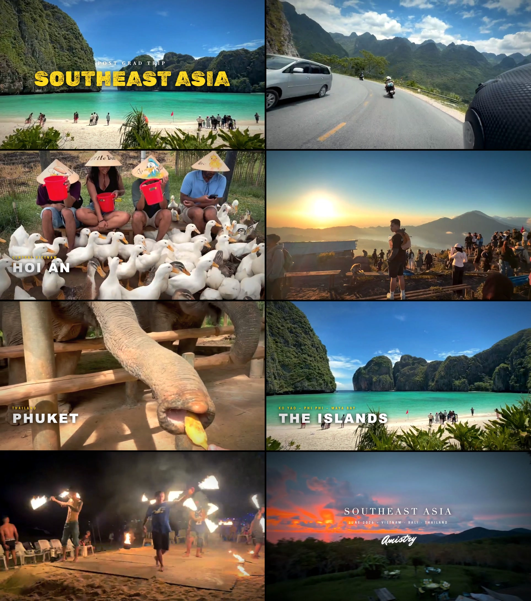

# sea-trip-vlog

A travel vlog of a 3-week post-grad trip through Southeast Asia — Vietnam → Bali →
Thailand, June 2026 — edited entirely in **code**. There is no Premiere or CapCut
project here: every cut, title, whip-pan, and sound effect is a React component
rendered to video with [Remotion](https://www.remotion.dev/).

<div align="center">

### [Watch the final cut on YouTube](https://youtu.be/eyZ28sKTlaA)

[](https://youtu.be/eyZ28sKTlaA)

</div>



## Wait, edited in code?

Yes. Remotion lets you describe video as React components: a `<Shot>` component says
"play clip 212 starting 3 seconds in, at half speed, with a whip-pan entrance," and
Remotion renders it frame-by-frame into an mp4. That means the whole edit is text
files you can diff, review, and (as happened many times here) let an AI agent revise.

The edit itself lives in `src/lib/timeline.ts`, and its core trick is that it is
expressed in **beats, not seconds**. The music edit runs on a 133.33 BPM grid
(one beat every 0.45 s), so the timeline says things like "this drone shot lasts
4 beats, then the drop hits and the title slams in." Consequences of that design:

- every single cut lands exactly on the musical grid;
- chapters (HANOI, HA GIANG, DA NANG, HOI AN, BALI, PHUKET, THE ISLANDS, BANGKOK)
  start on 8-bar phrase boundaries;
- the three drops in the track line up with hero shots and title slams by
  construction, not by nudging clips around on a timeline.

## How it was made

**1. Catalog the footage.** ~330 phone and GoPro clips went into `assets/clips`.
`scripts/build-catalog.py` probes each one (duration, resolution, frame rate,
recording timestamp) and writes `data/footage-catalog.json`, so the edit can refer to
"clip 212" and trust its metadata. The recording timestamps are what let the edit
stay in true chronological trip order.

**2. Beat-map the music.** The track's beat grid and section energy were measured
and stored in `data/beats.json`. Landmarks (drop 1 at beat 17, drop 2 at beat 49,
the final slam at beat 320) are documented at the top of `src/lib/timeline.ts`.

**3. Study how the pros do it.** Four reference vlogs were analyzed frame by frame —
scene-change detection, shot-length statistics, cut-to-onset sync measurement, effect
and sound-design inventories. The write-up is in
[`analysis/reanalysis-samples/report.md`](analysis/reanalysis-samples/report.md) and
it directly drove the style: median shot lengths under a second in montages, cutting
to musical onsets, rapid-fire "hyper-montage" bursts, and a title that flickers
between fonts.

**4. Build the effects as components.** Everything in `src/components/`:
whip-pan wipes, radial zoom-blur bursts, impact punch-ins, exposure flashes, the
multi-font flicker title, location cards, film grain and grade, and a black-&-white
viewfinder treatment. Sound design is synthesized from scratch by
`scripts/make-sfx.py` (whooshes, risers, sub-bass impacts, a camera shutter) — no
sample packs.

**5. AI mattes for depth.** `scripts/make-mattes.py` uses
[rembg](https://github.com/danielgatis/rembg) to cut the subject out of a few key
shots and save it as a transparent-video matte (`public/mattes/*.webm`), which is how
chapter text slides *behind* a person — or an elephant — instead of just sitting on top.

**6. QC like an editor.** The `analysis/` folder is the workbench: contact sheets of
the render, frame-grabs around every suspicious cut, beat-sync measurements, and
per-draft QC reports. It's all committed because it's half the fun of the project.


## What's in the repo

| Path | What it is |
| --- | --- |
| `src/` | The video: compositions, effect components, and the beat-grid timelines |
| `scripts/` | Catalog builder, SFX synth, matte generator, timeline validators/exporters |
| `data/` | Footage catalog, beat maps, resolved timeline JSON exports |
| `analysis/` | Style research on reference vlogs + QC stills and reports for each draft |
| `public/` | Runtime assets; the heavy generated parts are gitignored (see below) |

Not in the repo (gitignored, too big for git): `assets/` (~1.3 GB of source
footage and music), `out/` (renders), `vlog-samples/` (reference videos), generated
`.wav`/`.webm` files in `public/`. `public/clips` is a committed symlink pointing at
`assets/clips`.

## Running it yourself

You need Node 18+, Python 3, and ffmpeg. Without the source footage you can still
read the whole edit; to actually render you need clips in place.

```bash
npm install

# put source footage + music where the project expects them
#   assets/clips/  <- your video clips
#   assets/music/  <- the track(s)

# regenerate the derived assets
python3 scripts/build-catalog.py   # probe clips -> data/footage-catalog.json
python3 scripts/make-sfx.py        # synthesize sound effects -> public/sfx/
python3 scripts/make-mattes.py     # cut subject mattes -> public/mattes/ (needs rembg)

# open the live editor (scrub the timeline in a browser)
npm run dev

# sanity-check the edit, then render
npx tsx scripts/validate-timeline.ts
npm run render            # full quality -> out/vlog.mp4
npm run render:preview    # fast half-res draft
```

There are also two earlier one-song edits kept in the repo (`TalkToYou` and
`NiceForWhat` compositions) with their own `render:talk` / `render:nfw` scripts —
the main `Vlog` composition is the finished piece.
